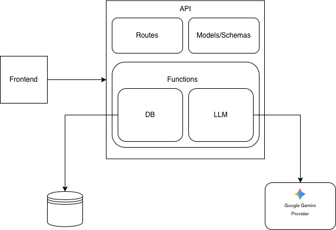
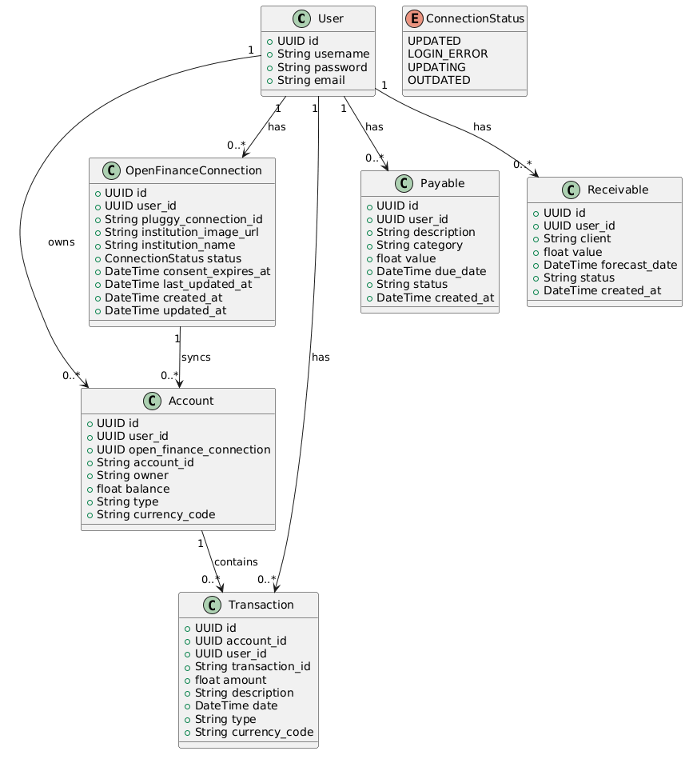

# bot-finance-backend
# Equipe
- Luis Henrique (Luishma34)
- Emanuel Dias (emanueldias01)
- Kauã José (KpSantiago)

# Documentação do projeto
- protótipo: https://github.com/emanueldias01/prototipo-botfinance
- Requisitos: https://docs.google.com/document/d/11uApb0cqCNl2Q30ZxJYPjX1EBf_Rs9_mGM9DSawvSzY/edit?tab=t.0
- Planejamento de sprints: https://docs.google.com/document/d/1pImpKG7Rp6J_iV3AmE_-zYhpRuhEjb-_ltNex9nqYr0/edit?usp=sharing
- Trello: https://trello.com/b/4hp22WQz/botfinance
- Arquitetura

- Diagrama de classes
